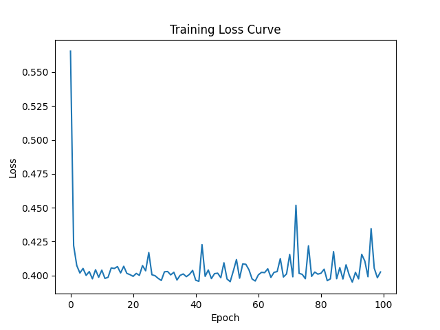
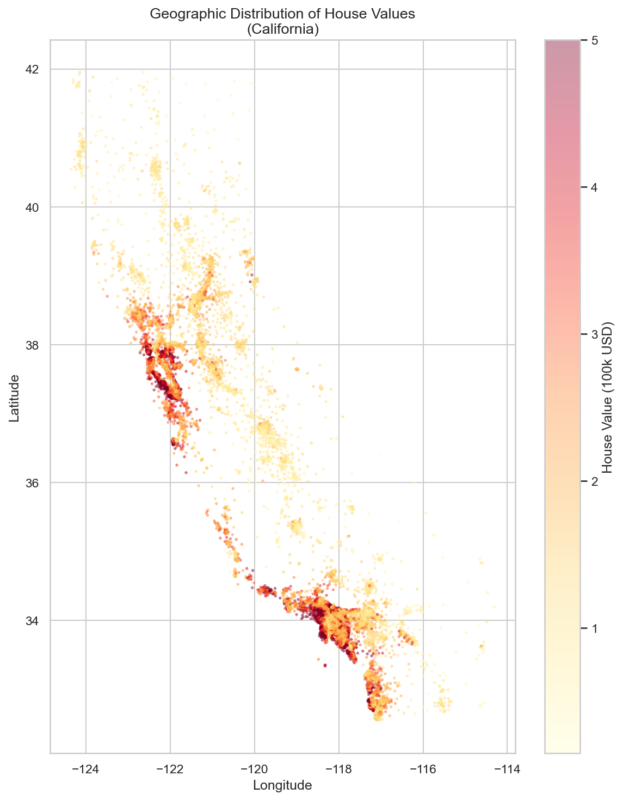
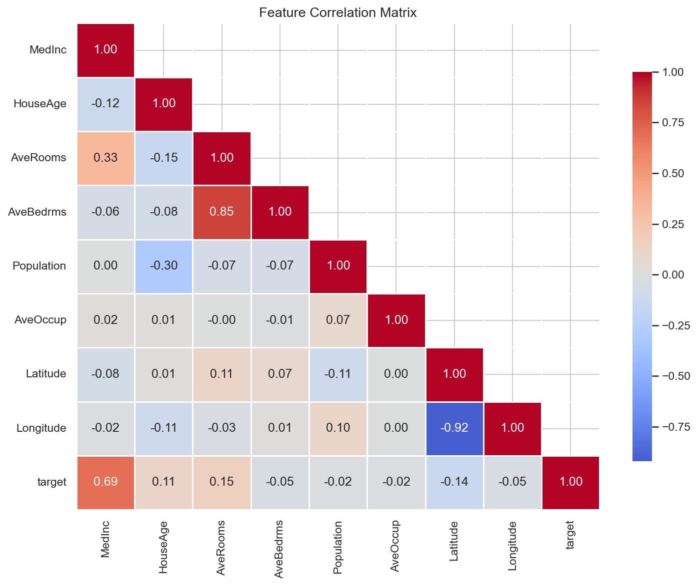
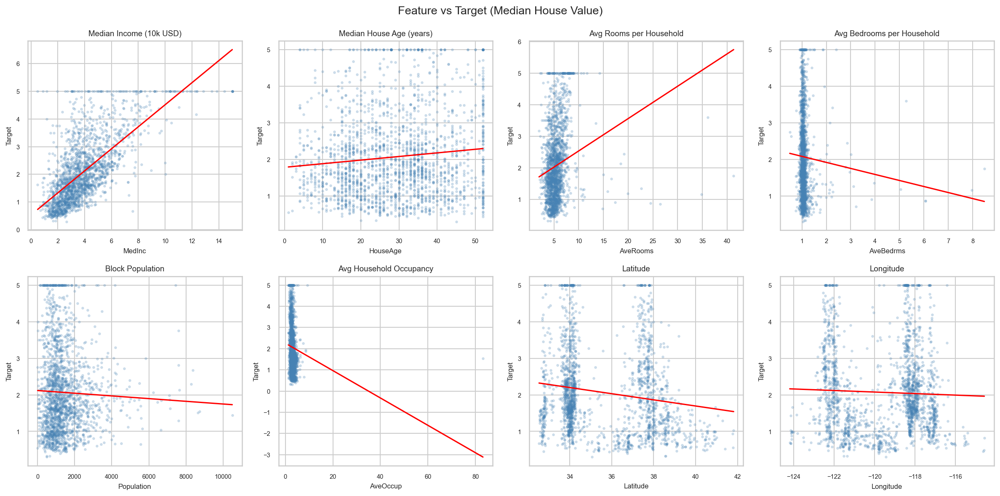

# Linear Regression — Production Ready

> Predicting California housing prices with PyTorch, built with production engineering practices:
> OOP design, CLI, logging, unit tests, and clean project structure.

---

## Problem Statement

Given census data about a California neighbourhood — median income, house age,
average rooms, population density, and geographic coordinates — **predict the
median house value** of that district.

This is a classic regression problem. The goal here is not just to solve it,
but to solve it the way a real ML engineer would: clean code, testable
components, reproducible runs, and clear documentation.

---

## Project Structure

```
DL_module1_linear_regression/
│
├── src/
│   ├── __init__.py
│   ├── model.py          # LinearModel — nn.Module subclass
│   ├── trainer.py        # Trainer — fit, predict, save, load
│   └── data.py           # CustomDataset + get_dataloader
│
├── tests/
│   └── test_trainer.py   # pytest — 3 unit tests
│
├── plots/
│   ├── loss.png          # Training loss curve
│   └── eda/              # EDA plots (generated by eda.py)
│
├── models/
│   └── linear_model.pth  # Saved model weights
│
├── train.py              # CLI entry point
├── eda.py                # Exploratory Data Analysis script
├── generate_data.py      # Downloads and saves California Housing as CSV
├── requirements.txt
└── README.md
```

---

## Pipeline

```
data.csv
   │
   ▼
CustomDataset          — validates, normalizes (z-score), converts to tensors
   │
   ▼
DataLoader             — batches and shuffles
   │
   ▼
LinearModel            — nn.Module with single nn.Linear layer
   │
   ▼
Trainer.fit()          — SGD optimizer, MSELoss, logs every 10 epochs
   │
   ├──▶  models/linear_model.pth   (torch.save state_dict)
   └──▶  plots/loss.png            (matplotlib loss curve)
```

---

## Dataset — California Housing

| Property | Value |
|----------|-------|
| Source | `sklearn.datasets.fetch_california_housing` |
| Rows | 20,640 |
| Features | 8 |
| Target | Median house value (in $100k) |
| Missing values | None |

### Features

| Feature | Description | Mean | Std | Range |
|---------|-------------|------|-----|-------|
| `MedInc` | Median income (10k USD) | 3.87 | 1.90 | 0.50 – 15.00 |
| `HouseAge` | Median house age (years) | 28.6 | 12.6 | 1 – 52 |
| `AveRooms` | Avg rooms per household | 5.43 | 2.47 | 0.85 – 141.9 |
| `AveBedrms` | Avg bedrooms per household | 1.10 | 0.47 | 0.33 – 34.1 |
| `Population` | Block population | 1,425 | 1,132 | 3 – 35,682 |
| `AveOccup` | Avg household occupancy | 3.07 | 10.4 | 0.69 – 1,243 |
| `Latitude` | Block latitude | 35.6 | 2.14 | 32.5 – 42.0 |
| `Longitude` | Block longitude | -119.6 | 2.00 | -124.3 – -114.3 |

### Target

| Stat | Value |
|------|-------|
| Min | $14,999 |
| Max | $500,001 |
| Mean | $206,900 |
| Std | $115,400 |

### Key EDA Findings

- **MedInc has the strongest correlation with target** (+0.69) — income is the
  single best predictor of house value
- **Latitude/Longitude show geographic clustering** — coastal and Bay Area
  districts command much higher prices
- **Population and AveOccup are right-skewed** with extreme outliers —
  z-score normalization is critical before training
- **AveRooms and AveBedrms** have outliers up to 141 and 34 rooms respectively
  — likely data entry errors or unusual properties

### EDA Plots

| Plot | Description |
|------|-------------|
| `plots/eda/01_target_distribution.png` | Histogram + boxplot of house values |
| `plots/eda/02_feature_distributions.png` | Distribution of all 8 features |
| `plots/eda/03_correlation_heatmap.png` | Feature correlation matrix |
| `plots/eda/04_feature_vs_target.png` | Scatter plots with trend lines |
| `plots/eda/05_geographic_heatmap.png` | House values mapped across California |

---

## Installation

### System requirements
- Python 3.10+
- No GPU required — trains on CPU in ~25 seconds

### Install dependencies

```bash
pip install -r requirements.txt
```

### requirements.txt

```
torch
pandas
numpy
matplotlib
seaborn
scikit-learn
pytest
python-dotenv
ruff
```

---

## How to Run

### Step 1 — Generate the dataset

```bash
python generate_data.py
```

Creates `data.csv` with 20,640 rows.

### Step 2 — Run EDA (optional but recommended)

```bash
python eda.py
```

Prints summary statistics and saves 5 plots to `plots/eda/`.

### Step 3 — Train

```bash
python train.py --data data.csv --epochs 100 --learning_rate 0.01 --batch_size 64
```

**All CLI arguments:**

| Argument | Default | Description |
|----------|---------|-------------|
| `--data` | required | Path to CSV file |
| `--epochs` | 100 | Number of training epochs |
| `--learning_rate` | 0.01 | SGD learning rate |
| `--batch_size` | 32 | Samples per batch |

### Step 4 — Inspect outputs

```
models/linear_model.pth   ← saved weights
plots/loss.png            ← loss curve
```

---

## How to Predict

Load the saved model and run inference:

```python
import torch
from src.model import LinearModel
from src.trainer import Trainer

# Rebuild model and load weights
model = LinearModel(input_dim=8)
trainer = Trainer(model, optimizer=None, criterion=None, epochs=0)
trainer.load("models/linear_model.pth")

# Prepare input (must be normalized the same way as training data)
X = torch.tensor([[3.5, 30.0, 5.2, 1.1, 800.0, 3.0, 37.8, -122.4]], dtype=torch.float32)
from torch.utils.data import DataLoader, TensorDataset
loader = DataLoader(TensorDataset(X, torch.zeros(1, 1)), batch_size=1)

prediction = trainer.predict(loader)
print(f"Predicted house value: ${prediction.item() * 100_000:.0f}")
```

---

## Results

| Metric | Value |
|--------|-------|
| Dataset | California Housing — 20,640 samples |
| Model | Linear Regression (`nn.Linear(8, 1)`) |
| Optimizer | SGD |
| Loss function | MSELoss |
| Final loss | ~0.40 (normalized MSE) |
| Training time | ~25 seconds on CPU |
| Code style | ruff — all checks passed  |
| Tests | 3/3 passing  |

### Loss Curve



The model converges within the first 10 epochs and stabilizes around MSE 0.40.
The remaining error reflects the **irreducible non-linearity** in the data —
a linear model cannot capture interactions between features like income × location.
This is the natural ceiling for this architecture.

---

### EDA Highlights

#### Geographic Distribution of House Values

*Coastal and Bay Area districts (dark red) command significantly higher prices —
location is a stronger signal than the model can fully capture with linear weights alone.*

#### Feature Correlations

*MedInc has the strongest positive correlation with target (+0.69).
Latitude shows a negative correlation — northern districts tend to be cheaper.*


#### Feature vs Target

*Red trend lines show the linear relationship each feature has with house value.
MedInc is the clearest linear signal; Population and AveOccup are noisy with outliers.*

---

## Running Tests

```bash
pytest tests/ -v
```

Expected output:

```
tests/test_trainer.py::test_loss_decreases       PASSED
tests/test_trainer.py::test_predict_output_shape PASSED
tests/test_trainer.py::test_save_and_load        PASSED
3 passed in 4.6s
```

### What the tests cover

| Test | What it verifies |
|------|-----------------|
| `test_loss_decreases` | Loss after training is lower than before |
| `test_predict_output_shape` | Output tensor has correct shape `(n, 1)` |
| `test_save_and_load` | Saved and reloaded model produces identical predictions |

---

## Code Quality

```bash
ruff check .
# All checks passed!
```